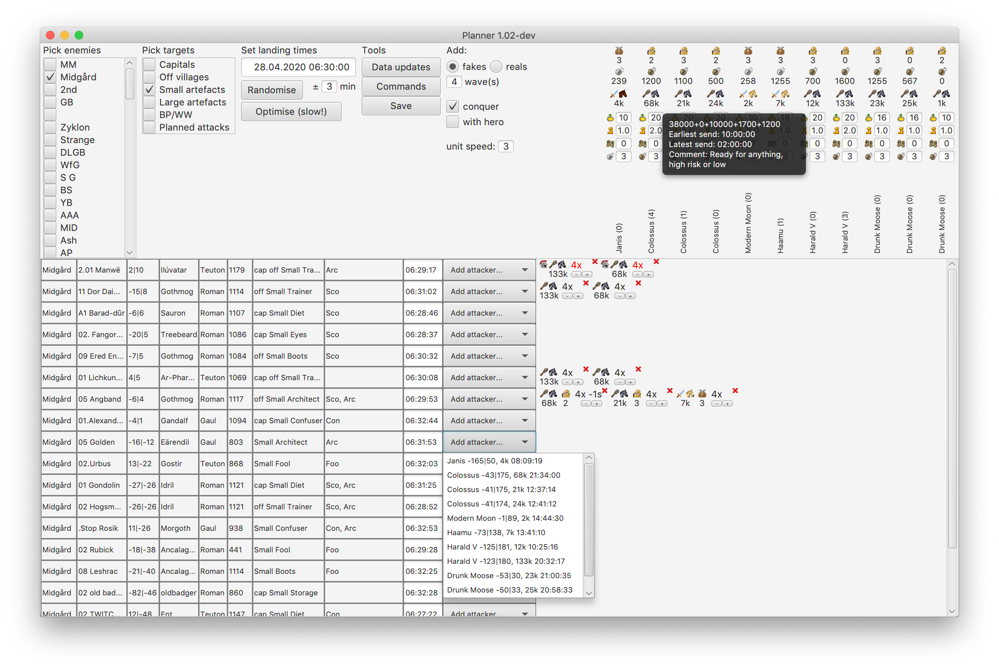

# Operation planner for Travian (version T4, 2019->)
This tool makes it easy to plan coordinated attack operations for the browsergame Travian (https://www.travian.com/). 
By copying and pasting information from the game, the program parses relevant data and creates a simple visual sheet for planning.
The program computes sending times for all participants and supports hitting time randomisation, sending time conflict scheduling,
easy hitting order adjusting, cross-faking, and chief/hero faking.
When you're ready, you can just grab the templated operation commands and send away!

## Installation
Some releases will include installers for Windows and macOS. 
If these are not available, you are running some other OS, or you're experiencing trouble with the installers: 
download the sources, install Java SDK version 12, install Gradle (https://gradle.org/) and run `gradle run` in the root folder.
Older Java versions may work, but are not supported.

### Windows
Double click the .exe and follow the instructions.

### macOS
Open the .dmg and drag the app to your Applications folder.

## Usage

### Data update view
The first screen you see. The first button lets you select a map.sql file. 
This is a file that is available for download from the Travian server (add /map.sql to the server URL) and contains information about the map.

Three text fields follow; the first is for marking enemy villages as capitals or offensive villages for planning purposes. 

The second is for updating the artefacts on the server. This is done by pasting the source code of the treasury pages.

The last box is for updating the operations participant list. Tip: assemble the participants in a spreadsheet first. 
If you pasted something in the field and click "New operation", the current participants will be replaced by the new ones.
If there was nothing in the text field, a blank operation will be created with the previous participants from the database.
"Load operation" loads the last saved operation from the database - if participants have changed, some attacks may not load.

### Planning view
Tool highlights:
- Randomise - randomises all target hitting times over a set interval. 
Useful to prevent leaking information to the enemy when executing the operation.
- Optimise - adjusts the hitting times for all planned targets with a genetic algorithm to create a schedule that works for every participant while
not allowing the enemy too much reacting time. If the initial interval is too short, the tool increases it by one minute and tries again. 
Takes a few seconds, depending on how many intervals it needs to try.
The maximum is +- 10 minutes or the interval set in the above field.
Extremely useful to prevent sending time conflicts when one or more participants have speed artefacts and the targets are located close to each other.
- Listing of targets - details of the target villages are displayed, among others the relevant artefact effects on that village in the eighth column.
- Add attacker - every target has a button to add an attacker to that target. 
The planned attacks appear on the right and are ordered by hitting order, left hits first.
Initially, they will all have the same hitting time, but this is configurable with the +/- buttons.
The colour is red on real attacks and black on fakes. 
Hammer size, most prevalent troop types, and number of waves are displayed. 
If a hero or chiefs should be sent in this attack, they are displayed.
Click the red cross to remove the attack from the plan.
- Participant controls - freely play with tournament square levels, artefact effects, hero boots, and default unit speed to adjust hitting orders.
- Save - saves the current operation to the database. All planned attacks and all hitting times are saved. This will take a few seconds.

### Commands view
On the left, there are two text fields to edit the command template. Targets are rendered between these texts.

On the right, there is a text field for every participant that has planned attacks in the current operation.

## Future plans
Some features considered for future versions:
- Adjust server size and speed
- Adjust time zone and fastest sending interval per participant
- Support for battlegroups, adding attacks per group
- Autosave and cloud syncing for backups and co-operative planning
- Submit your idea by opening an issue here!